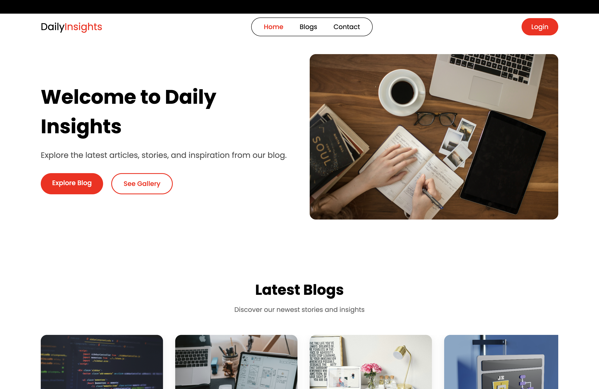

# 🌐 Daily Insights – Modern Responsive Blog Platform

Daily Insights is a modern, fully responsive blog website developed using **HTML5, CSS3, and JavaScript (ES6)**.  
The project showcases front-end development best practices including dynamic content rendering, client-side authentication logic, structured UI design, form validation, API integration, and responsive layouts.

This project was built as an academic and portfolio demonstration of clean, modular, and maintainable front-end architecture.

---

## 📸 Homepage Preview



---

## 🚀 Live Demo

🔗 **Live Website:** https://blog-platform-pi-five.vercel.app/  
🔗 **GitHub Repository:** https://github.com/MilanMoktan99/blog-platform  

---

# ✨ Key Features

### 🔹 Core Features
- Fully responsive modern UI
- Dynamic blog rendering using JavaScript
- Vertical blog listing layout
- Featured blog section on homepage
- Clean navigation bar and footer
- Modular project structure

### 🔹 Authentication System (Client-Side)
- User Registration
- Login functionality
- Password strength validation (Regex-based)
- Show / Hide password toggle
- Cookie-based credential storage (for demo purposes)

### 🔹 Form & API Integration
- Contact form with validation
- Integrated with Web3Forms API
- Fetch API POST request handling
- Dynamic success/error response messages

### 🔹 UI/UX Quality
- Clean spacing & typography
- Mobile-first responsive approach
- Flexbox layout system
- Structured and readable code
- Consistent design components

---

# 🏗️ Technical Implementation

### Front-End Architecture
- Semantic HTML5 structure
- Modular JavaScript files
- Reusable layout components
- Organized folder hierarchy

### Validation Logic
Password must contain:
- Minimum 8 characters
- At least one numeric digit
- At least one special character

Regular expressions are used for validation.

### Dynamic Blog Rendering
Blog data is stored in JavaScript objects and rendered dynamically using DOM manipulation.

---

# 🛠️ Technologies Used

| Technology | Purpose |
|------------|----------|
| HTML5 | Structure & semantic markup |
| CSS3 | Styling & responsive design |
| JavaScript (ES6) | Interactivity & dynamic rendering |
| Fetch API | API communication |
| Web3Forms API | Contact form backend service |
| Git & GitHub | Version control |

---

# 📂 Project Structure
Daily-Insights/
│
├── index.html
├── style.css
├── js/
│ ├── post.js
│ ├── auth.js
│ └── script.js
│
├── pages/
│ ├── blog.html
│ ├── login.html
│ ├── register.html
│ └── contact.html
│
├── assets/
│ ├── images/
│ │ └── homepage.png
│ └── icons/
│
└── README.md

---

# ⚙️ Installation & Setup

## 1️⃣ Clone the Repository

```bash
git clone https://github.com/MilanMoktan99/blog-platform

## 2️⃣ Navigate to the project folder

```bash
cd daily-insights

## 3️⃣ Run the project

```bash
open index.html file
use live server extension to run the project